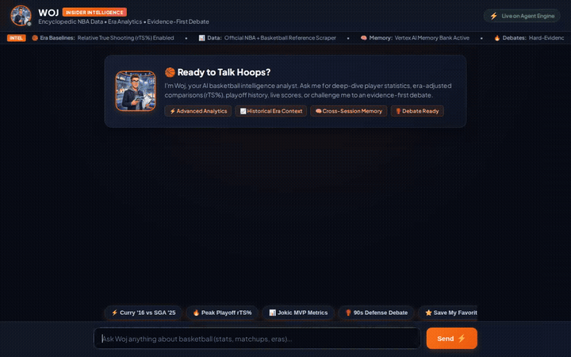

# 🏀 Woj — AI Basketball Intelligence Agent

> A conversational basketball intelligence agent that helps NBA fans and analysts research live and historical statistics, compare players across eras, and debate basketball arguments with evidence-first reasoning and advanced analytics.



---

## 🌟 What is Woj?

Named with inspiration from the ultimate NBA insider concept, **Woj** is a full-featured AI basketball analyst. Rather than relying on generic sports commentary or unsupported hot takes, Woj combines:

* **Encyclopedic NBA Knowledge & Real-Time Stats**: Integrates historical data and live league intelligence via the Basketball Reference scraper and NBA statistical feeds.
* **Era-Adjusted Analytics**: Evaluates shooting efficiency using Relative True Shooting (`rTS%`), Box Plus-Minus (`BPM`), Value Over Replacement Player (`VORP`), and possession-normalized metrics to fairly compare eras (e.g., 90s defenses vs. modern spacing).
* **Evidence-First Debate Engine**: Engages in deep basketball discussions, challenging assertions with historical box scores, playoff game logs, and efficiency metrics.
* **Long-Term Memory**: Remembers user preferences, favorite franchises, and past debate positions across sessions.

---

## ☁️ Google Cloud & Agent Platform Stack

Woj is built using the **Google Cloud Agent Development Kit (ADK)** and leverages Google Cloud's core AI and serverless tools:

| Google Cloud Service | Purpose in Woj |
| :--- | :--- |
| **Vertex AI Memory Bank** | Long-term memory engine (`VertexAiMemoryBankService`) that automatically extracts and recalls user debate stances, favorite teams, and historical arguments across sessions. |
| **Vertex AI Reasoning Engine** | Managed Agent Runtime hosting the agent application, tool executions, and security boundaries. |
| **Firestore** | Session and conversational state storage preserving multi-turn context. |
| **Cloud Storage** | Bucket storage for datasets, generated assets, and intermediate scraping cache. |
| **RAG (Grounding & Retrieval)** | Retrieval-augmented generation architecture grounding agent reasoning on factual basketball history. |
| **Imagen on Vertex AI** | Generates visual matchup previews and insider persona graphics. |
| **A2UI (Agent-to-User Interface)** | Emits structured UI cards, comparison tables, and list layouts rendered natively in the frontend. |
| **Cloud Run** | Serverless deployment hosting the FastAPI proxy and web chat interface. |

---

## 🎯 Key Features

1. **Era-Adjusted Player Comparisons**:
   Compares players across different eras by normalizing against league average baselines (e.g., comparing Stephen Curry's 2015-16 unanimous MVP season with +12.8% rTS% against Shai Gilgeous-Alexander's 2024-25 season).

2. **Automated Stat Sheet Rendering**:
   Markdown stat comparisons are dynamically rendered into formatted, zebra-striped sports tables with clean headers and visual styling.

3. **Multi-Turn Session Continuity**:
   Communicates over the **A2A Protocol** (`a2a-sdk`) through a lightweight FastAPI proxy, maintaining state and session context between turns.

4. **Modern Dark Arena Chat Interface**:
   Custom web UI with a dark arena broadcast aesthetic, real-time status indicators, breaking news capabilities ticker, and clickable quick-action chips.

---

## 🚀 Running Locally

### 1. Agent Runtime / ADK Dev Server
```bash
cd woj-agent
uv sync
adk web app
```

### 2. Frontend Chat UI & FastAPI Proxy
```bash
cd frontend
source .venv/bin/activate
# Ensure AGENT_ENGINE_RESOURCE_NAME and AGENT_DIRECTORY are set in .env
python main.py
```
Open `http://localhost:8080` in your browser.

---

## 🚢 Deploying to Google Cloud

### Deploy Agent to Vertex AI Agent Runtime
```bash
cd woj-agent
agents-cli deploy
```

### Deploy Web Frontend to Cloud Run
```bash
cd frontend
gcloud run deploy woj-frontend \
  --source . \
  --region us-east1 \
  --allow-unauthenticated \
  --set-env-vars AGENT_ENGINE_RESOURCE_NAME=<YOUR_AGENT_RESOURCE_NAME>,AGENT_DIRECTORY=app
```

Ensure the Cloud Run service account is granted `roles/aiplatform.user` so it can reach the Agent Runtime endpoint.

---

## 📄 License
MIT License. Built for the Google Cloud *Build With Gemini* Agent Platform program.
